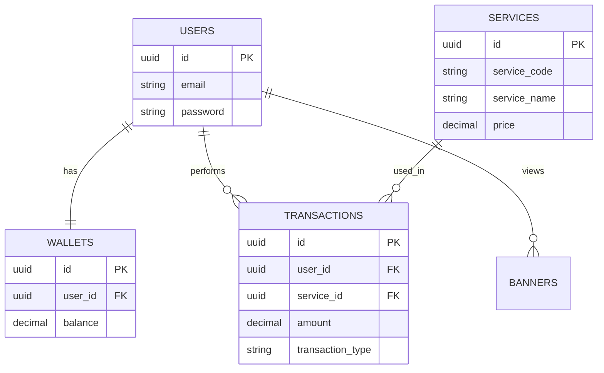

# Test Backend Programmer HIS

**Take Home Test Backend Programmer**
PT Nutech Integrasi
Author: **Naufal Puji Mahdy**

---

## Deskripsi Project

- Authentication & Authorization menggunakan **JWT**
- Manajemen saldo
- Transaction history
- Validasi
- Pemisahan layer Controller – Service – Repository
- Dokumentasi API menggunakan Swagger

---

## Tech Stack

- **Node.js**
- **Express.js**
- **TypeScript**
- **PostgreSQL**
- **JWT**
- **Swagger / OpenAPI 3.0**
- **Docker & Docker Compose**

---

## Struktur Folder Project

```bash
.
├── dist/
├── node_modules/
├── src/
│   ├── controllers/
│   ├── db/
│   ├── docs/
│   ├── middlewares/
│   ├── repositories/
│   ├── routes/
│   ├── services/
│   ├── types/
│   ├── utils/
│   ├── app.ts
│   └── server.ts
├── uploads/
├── .dockerignore
├── .env
├── .env.example
├── .gitignore
├── docker-compose.yml
├── Dockerfile
├── package.json
├── package-lock.json
├── tsconfig.json
└── README.md
```

---

## Database Design (DDL)

Desain database menggunakan **PostgreSQL** dengan tabel utama:

- **users** — data user
- **wallets** — saldo user
- **services** — layanan yang tersedia
- **transactions** — riwayat transaksi
- **banners** — banner informasi

---

## Database ERD


